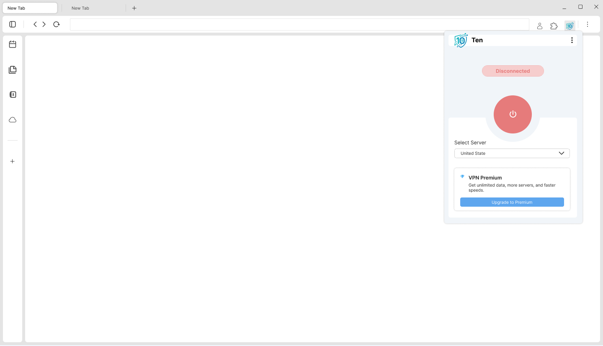

<div style="text-align: center;">
    
</div>

<h1 style="text-align: center;">Ten-VPN-Extension</h1>

<p style="text-align: center">
  
  
  
  
  
  
</p>


A modern and lightweight VPN extension built with **Vue**, **Pinia**, and **Webpack**, compatible with **Chrome** and **Firefox**.
It provides traffic redirection through configurable HTTP/S proxy servers and allows easy configuration switching based on the environment (`development`, `production`) and the browser.


## 🚀 Key Features

- 🔐 Traffic redirection through proxies (VPN mode).
- 🌍 Cross-platform support: **Chrome** and **Firefox**.
- ⚙️ Dynamic configuration using `.env` files.
- 📦 Automated build with Webpack + ready-to-publish ZIP.
- 💾 Persistent storage using `Pinia` + `chrome.storage`.
- 🧩 Modern interface built with **Vue 3**.

---

## 🖥️ Demo / Preview

<p align="center">
  
</p>

---

## 🏁 Getting Started

This section will help you set up the VPN Extension project on your local machine for development and testing purposes.

### ✅ Prerequisites

Make sure you have the following installed on your system:

- [Node.js](https://nodejs.org/) (v16 or higher)
- [npm](https://www.npmjs.com/)
- A Chromium-based browser (e.g. Chrome, Edge) or Firefox

To verify if you have Node.js and npm installed:

```bash
node -v
npm -v
```
If not installed, download and install them from the official website.

---

## 🧰 Local Installation and Setup
This section explains how to clone the repository and run the project in local development mode.

## 📥 Clone the repository
```bash
git clone https://github.com/Im-Jota/ten-vpn-extension.git
cd ten-vpn-extension
```

## 📦 Install dependencies
Use npm to install the required packages:

```bash
npm install
```

## ⚙️ Environment Configuration (.env)
Copy the example file .env.example and rename it to `.env`:
```bash
cp .env.example .env
```

Inside the `.env` file, configure the necessary variables. For example:
```bash
BROWSER=firefox
APP_ENV=development
```

## 🚧 Run in development mode
This command builds the extension and keeps a watcher active to automatically reload files when changes are made:

```js
npm run dev //The generated files will be in the dist/ folder.
```

## 📦 Build for production
This command optimizes and generates the files ready for publishing or packaging:

```bash
npm run build
```
---

## 🙌 Ready to use!

With these steps, you have your environment set up to develop, test, and build your own multiplatform VPN extension.

---

**Built with ❤️ using Vue, Pinia, and Webpack**

---